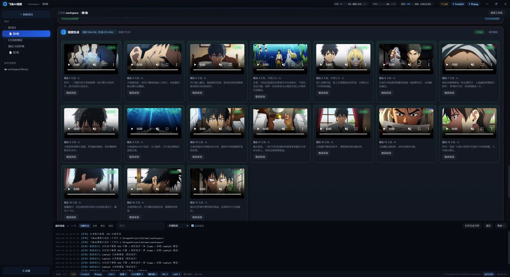

# 飞鱼AI漫剧

把小说章节一键改编成漫剧（分镜 → 角色 → 提示词 → 视频 → 成片）的本地桌面工具。
所有推理都在你自己的显卡上完成，不依赖任何云端 API，创作内容不出本机。

## 功能流程（7 个阶段）

1. **章节原文** — 粘贴小说章节
2. **漫剧改编** — LLM 删心理描写、保留冲突对白，可手工编辑
3. **分镜脚本** — 自动拆分镜头（场景/角色/动作/对白/秒数），同时产出角色与场景档案
4. **角色 & 场景** — SDXL 逐个生成角色图与场景图，全部锁定后全剧一致
5. **H3 提示词** — 按镜头生成结构化提示词
6. **H3 视频** — MiniMax H3 逐镜头生成视频片段
7. **组装成片** — ffmpeg 拼接 + 字幕烧录，导出 MP4

支持多项目 / 多文件夹 / 多集数；每一步有日志与耗时；退出保存现场，下次原样恢复。
> 四个文字环节（漫剧改编 / 分镜脚本 / 角色 & 场景 / H3 提示词）的提示词规范放在每个项目的 `prompts/*.md`，可自由编辑；本项目内置一份，缺失会自动补回。

## 环境要求

| 组件 | 要求 |
|---|---|
| 操作系统 | Windows 10 / 11 |
| 显卡 | NVIDIA，8GB 显存起步；**16GB 可跑全部功能** |
| Node.js | ≥ 20（仅源码运行需要） |
| ComfyUI Desktop | 出图（SDXL）与出视频（H3）的推理后端，[comfy.org](https://www.comfy.org/download) |
| llama.cpp | 文本推理（CUDA 构建版），[GitHub Releases](https://github.com/ggml-org/llama.cpp/releases) |
| ffmpeg | 成片组装，需 **full build（含 libass）**，[gyan.dev](https://www.gyan.dev/ffmpeg/builds/) |

> llama.cpp 下载 `llama-bXXXXX-bin-win-cuda-13.4-x64.zip` 后，**必须**再下同一个
> Release 的 `cudart-llama-bin-win-cuda-13.4-x64.zip`，把其中 3 个 DLL
> （`cudart64_13.dll` / `cublas64_13.dll` / `cublasLt64_13.dll`）解压到 `llama-server.exe`
> 同目录。**缺了不报错，但会静默回退 CPU，慢 6 倍**。验证：`.\llama-cli.exe --list-devices`
> 输出里有 `CUDA0` 才算 GPU 就绪。

## 模型下载与放置位置

模型统一放在 **ComfyUI 的 models 目录**（软件设置里可指定，支持自动检测）：

| 模型 | 用途 | 放置位置 | 下载来源 |
|---|---|---|---|
| Qwen3.5-9B（`Q5_K_M.gguf` 约 7GB） | LLM 改编/分镜/提示词 | 任意目录，设置里指定 GGUF 目录 | ModelScope / HuggingFace 搜 `Qwen3.5-9B-GGUF` |
| Animagine XL 4.0（约 7GB） | 二次元角色出图 | `models\checkpoints\` | Civitai / LiblibAI / ModelScope（认准单文件 `.safetensors`） |
| MiniMax H3 fl2va 主模型（int8 约 19.5GB） | 文字/首尾帧生成视频 | `models\diffusion_models\` | ComfyUI Manager 模板下载 / HuggingFace `Comfy-Org` |
| Qwen3-VL 文本编码器（约 14.6GB） | H3 配套 | `models\text_encoders\` | 同上 |
| H3 视频 VAE（约 4.9GB）/ 音频 VAE（约 0.6GB） | H3 配套 | `models\vae\` | 同上 |
| H3 Turbo LoRA（4-step，约 1.8GB） | 提速 2 倍（fast 档） | `models\loras\` | 同上 |
| H3 ref2va 主模型（可选，约 19.5GB） | 参考图/参考视频生成（一致性更好） | `models\diffusion_models\` | 同上 |

> 工作流 JSON（角色出图 / H3 视频）首次运行会自动生成到 `workspace\workflows\`，无需手工准备；
> 模型文件名由软件自动填入工作流，不用手动改。

## 显存说明

**LLM（约 10.6GB）、生图（峰值约 15GB）、视频模型（约 19.5GB，靠显存↔内存换页）三者互斥**，
软件内置按阶段自动编排：进哪个阶段自动启停对应引擎、自动让出显存，无需手工干预。

- 16GB 卡实测：Qwen3.5-9B 加载约 4 秒、生成 59.6 tok/s；生图/视频全流程可跑
- 显存 ≥ 24GB 可在设置里关闭自动编排，减少启停等待
- 遇到 `CUDA out of memory`：确认 llama-server 已停（可点设置页「立即释放显存」）

## 常见问题

| 现象 | 原因 / 解决 |
|---|---|
| 生成极慢、GPU 占用几乎为 0 | llama.cpp 缺 CUDA 运行时（静默回退 CPU）→ 补 3 个 DLL，见上文环境要求 |
| `unknown value for --flash-attn: '--jinja'` | llama.cpp 新版要写 `-fa on`，不能裸写 `-fa` |
| `invalid argument: --no-mmap` | 参数已改名，用 `-lm none` |
| 导出报「未找到 ffmpeg」 | 把 `ffmpeg.exe` 放到 `workspace\tools\`，或加入 PATH / 设置里指定 |
| 导出报 subtitles / Invalid argument | ffmpeg 需含 libass 的 **full build**（gyan.dev 的 full 版） |
| 出图是写实风不是动漫 | checkpoints 里没有二次元底模 → 下载 Animagine XL 4.0 |
| 「工作流占位符未解析：__H3_XXX__」 | 对应 H3 模型没下载，按提示补齐 |
| `CUDA out of memory` | 停掉 llama-server / 降低分辨率帧数 / 使用 Turbo LoRA 4 步 |
| ComfyUI 点启动后一直不通 | Desktop 版首次启动较慢，等它的窗口出来再看；设置页可「重新检测」 |
| LLM 连不上 | llama-server 必须带 `--port 8080`（软件启动会自动补） |

## 快速开始

```bash
npm install
npm run dev      # 开发模式（vite + electron 并行，热更新）
```

首次启动后到「设置」确认：工作区目录（建议纯英文路径）、ComfyUI 模型根目录、
llama.cpp 目录三项；底栏 LLM / ComfyUI / ffmpeg 三个胶囊全绿即可开始创作。

## 打包

```bash
npm run dist     # vite build + electron-builder → NSIS 安装包
```

## 交流

QQ 群：**1036028422** — 使用中有问题欢迎进群讨论。

## 截图



## License

仅供学习交流使用。
