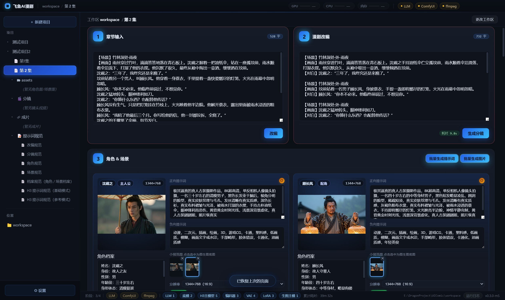
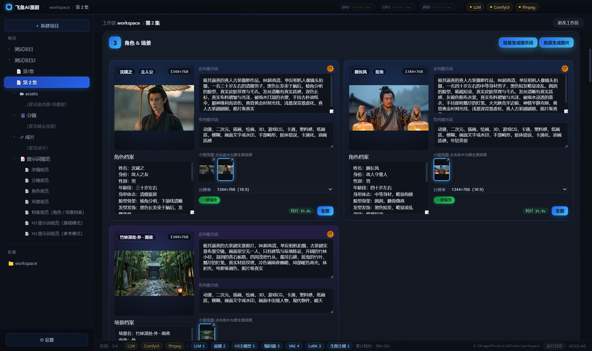
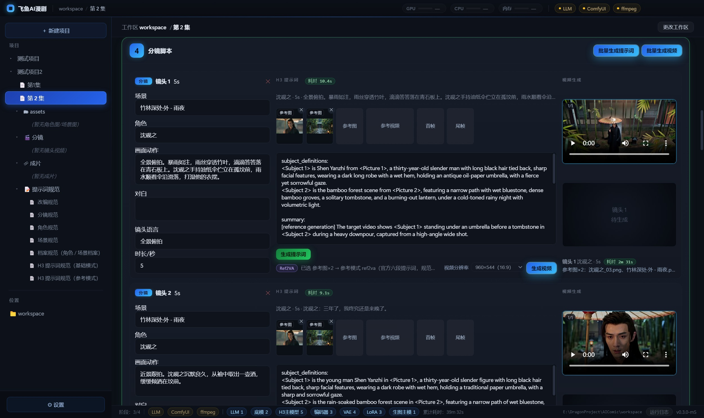
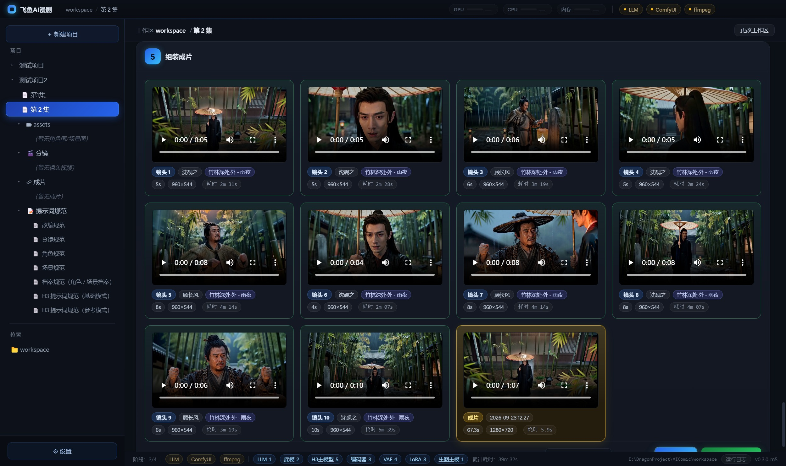

# 飞鱼AI短剧 Studio

把小说章节一键改编成漫剧的本地桌面工具：**改编 → 角色场景 → 分镜（提示词 + 视频）→ 组装成片**。
所有推理都在你自己的显卡上完成，不依赖云端 API，创作内容不出本机。

支持多项目 / 多文件夹 / 多集数；提示词规范可自由编辑；退出保存现场，下次原样恢复。

## 界面流程（5 个模块）

1. **章节输入 / 漫剧改编** — 粘贴小说原文，LLM 改编成分镜用剧本（可手改）
2. **角色 & 场景** — 从改编稿提取角色/场景档案，Z-Image Turbo 出图，全剧一致
3. **分镜脚本** — 自动拆镜头（场景/角色/动作/对白/秒数）→ H3 提示词 → 逐镜头出视频
4. **组装成片** — ffmpeg 拼接 + 字幕烧录，导出 MP4

## 界面实拍

以下为真实项目（第 2 集）的运行截图：

| 漫剧改编 | 角色 & 场景 |
|---|---|
|  |  |
| **分镜脚本** | **组装成片** |
|  |  |

## 环境要求

| 组件 | 说明 | 下载 |
|---|---|---|
| Windows 10 / 11 + NVIDIA 显卡 | 8GB 起步，**16GB 可跑全部功能** | — |
| ComfyUI Desktop | 出图 / 出视频的推理后端 | [comfy.org/download](https://www.comfy.org/download) |
| llama.cpp（CUDA 版） | 文本推理 | [GitHub Releases](https://github.com/ggml-org/llama.cpp/releases) |
| ffmpeg（full build 含 libass） | 成片组装 | [gyan.dev](https://www.gyan.dev/ffmpeg/builds/) |

> llama.cpp 下载 `llama-bXXXXX-bin-win-cuda-x64.zip` 后，**必须**再下同一 Release 的
> `cudart-llama-bin-win-cuda-x64.zip`，把其中 3 个 DLL 解压到 `llama-server.exe` 同目录。
> 缺了不报错但会静默回退 CPU、慢 6 倍。验证：`.\llama-cli.exe --list-devices` 输出里有 `CUDA0`。

## 模型下载（全部为 hf-mirror 国内镜像直链，无需科学上网）

模型统一放到 **ComfyUI 的 models 目录**（软件设置里可指定，支持自动检测）。
点链接直接下载，放进对应文件夹即可；文件名由软件自动识别，不用手动改。
（链接为 [hf-mirror.com](https://hf-mirror.com) 提供的 HuggingFace 国内镜像，与官方仓库同步）

### 必下

| 文件 | 大小 | 放到 | 直链 |
|---|---|---|---|
| Qwen3.5-9B-Q5_K_M.gguf（文本 LLM） | 约 7GB | 任意目录，设置里指定 GGUF | [下载](https://hf-mirror.com/bartowski/Qwen_Qwen3.5-9B-GGUF/resolve/main/Qwen3.5-9B-Q5_K_M.gguf) |
| z_image_turbo_bf16.safetensors（生图主模型） | 约 12GB | `models\diffusion_models\` | [下载](https://hf-mirror.com/Comfy-Org/z_image_turbo/resolve/main/split_files/diffusion_models/z_image_turbo_bf16.safetensors) |
| qwen_3_4b.safetensors（生图文本编码器） | 约 8GB | `models\text_encoders\` | [下载](https://hf-mirror.com/Comfy-Org/z_image_turbo/resolve/main/split_files/text_encoders/qwen_3_4b.safetensors) |
| ae.safetensors（生图 VAE） | 约 0.3GB | `models\vae\` | [下载](https://hf-mirror.com/Comfy-Org/z_image_turbo/resolve/main/split_files/vae/ae.safetensors) |
| minimax_h3_fl2va_pruned_int8_convrot.safetensors（视频主模型） | 约 21GB | `models\diffusion_models\` | [下载](https://hf-mirror.com/Comfy-Org/MiniMax-H3/resolve/main/diffusion_models/minimax_h3_fl2va_pruned_int8_convrot.safetensors) |
| qwen3vl_32b_minimax_h3_nvfp4_awq.safetensors（H3 文本编码器，50 系卡首选） | 约 15.7GB | `models\text_encoders\` | [下载](https://hf-mirror.com/Comfy-Org/MiniMax-H3/resolve/main/text_encoders/qwen3vl_32b_minimax_h3_nvfp4_awq.safetensors) |
| minimax_h3_video_vae_fp16.safetensors（H3 视频 VAE） | 约 5.2GB | `models\vae\` | [下载](https://hf-mirror.com/Comfy-Org/MiniMax-H3/resolve/main/vae/minimax_h3_video_vae_fp16.safetensors) |
| minimax_h3_audio_vae_fp32.safetensors（H3 音频 VAE） | 约 0.6GB | `models\vae\` | [下载](https://hf-mirror.com/Comfy-Org/MiniMax-H3/resolve/main/vae/minimax_h3_audio_vae_fp32.safetensors) |
| minimax_h3_fl2v_turbo_4step_v1.0_768p_comfyui_bf16.safetensors（加速 LoRA，快 2 倍） | 约 2GB | `models\loras\` | [下载](https://hf-mirror.com/Comfy-Org/MiniMax-H3/resolve/main/loras/minimax_h3_fl2v_turbo_4step_v1.0_768p_comfyui_bf16.safetensors) |

### 可选

| 文件 | 说明 | 直链 |
|---|---|---|
| minimax_h3_ref2va_pruned_int8_convrot.safetensors（约 21GB） | 参考图/参考视频生成（ref2va），一致性更好 | [下载](https://hf-mirror.com/Comfy-Org/MiniMax-H3/resolve/main/diffusion_models/minimax_h3_ref2va_pruned_int8_convrot.safetensors) |
| minimax_h3_ref2v_turbo_4step_v0.1_comfyui_bf16.safetensors（约 2GB） | ref2va 专用加速 LoRA | [下载](https://hf-mirror.com/Comfy-Org/MiniMax-H3/resolve/main/loras/minimax_h3_ref2v_turbo_4step_v0.1_comfyui_bf16.safetensors) |
| minimax_h3_fl2v_turbo_8step_v1.0_comfyui_bf16.safetensors（约 2GB） | 高质量档 LoRA（8 步，慢一点更细） | [下载](https://hf-mirror.com/Comfy-Org/MiniMax-H3/resolve/main/loras/minimax_h3_fl2v_turbo_8step_v1.0_comfyui_bf16.safetensors) |
| qwen3vl_32b_minimax_h3_int8_convrot.safetensors（约 27GB） | H3 文本编码器通用版（非 50 系卡用它） | [下载](https://hf-mirror.com/Comfy-Org/MiniMax-H3/resolve/main/text_encoders/qwen3vl_32b_minimax_h3_int8_convrot.safetensors) |

> 20GB 级大文件建议用 [aria2](https://github.com/aria2/aria2/releases) 多线程下载（`aria2c -x16 -s16 -c <直链>`），断点续传更稳。

## 显存说明

LLM（约 10GB）、生图、视频模型（约 21GB）三者互斥，软件按阶段自动启停引擎、自动让出显存，无需手工干预。
遇到 `CUDA out of memory`：点设置页「立即释放显存」，或降低分辨率/使用 4 步 Turbo LoRA。

## 快速开始

```bash
npm install
npm run dev      # 开发模式（vite + electron 并行，热更新）
```

或双击 `start-gui.bat`。首次启动到「设置」确认：工作区目录（建议纯英文路径）、ComfyUI 模型根目录、
llama.cpp 目录三项；底栏 LLM / ComfyUI / ffmpeg 三个胶囊全绿即可开始创作。

## 常见问题

| 现象 | 解决 |
|---|---|
| 生成极慢、GPU 占用几乎为 0 | llama.cpp 缺 CUDA 运行时 → 补 3 个 DLL，见上文 |
| 导出报「未找到 ffmpeg」/ subtitles 报错 | ffmpeg 需 **full build**（gyan.dev 的 full 版），放到 `workspace\tools\` 或加入 PATH |
| 出图报模型找不到 | 设置里「重新检测」，确认 z_image_turbo 三件套已放对目录 |
| 「工作流占位符未解析：__H3_XXX__」 | 对应 H3 模型没下载，按提示补齐 |
| `CUDA out of memory` | 设置页「立即释放显存」/ 降低分辨率帧数 / 用 4 步 Turbo LoRA |
| LLM 连不上 | llama-server 必须带 `--port 8080`（软件启动会自动补） |

## 交流

QQ 群：**1036028422** — 使用中有问题欢迎进群讨论。

## 打赏

开源不易，从改编、出图到成片的每一步都是用爱发电。
如果这个软件帮你把小说变成了短剧，省下了真金白银的制作费，欢迎请作者喝杯咖啡 ☕
金额随意，心意最重要 —— 你的支持就是我继续更新的动力！

**打赏方式**：扫描下方二维码添加作者微信，备注「飞鱼」，添加后微信转账即可。

<p align="center"></p>

## License

随意使用，可商用。如果觉得好用，欢迎回来点个 Star 或请作者喝杯咖啡。
