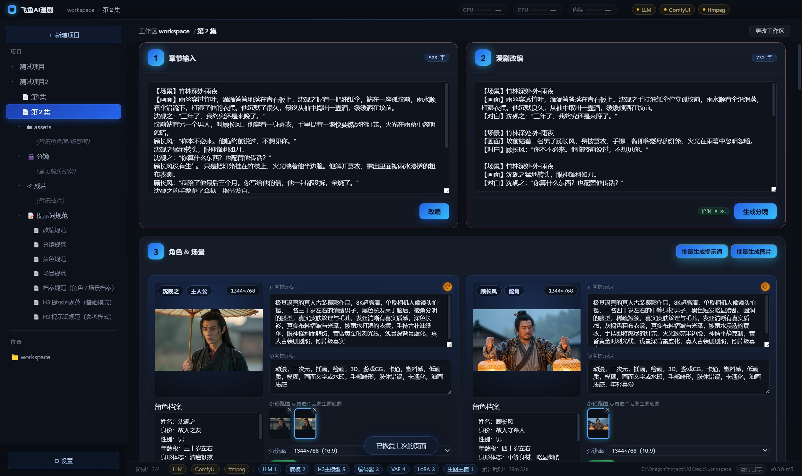
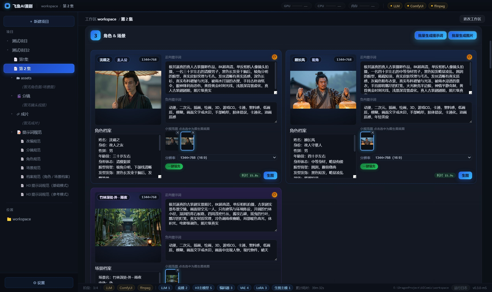
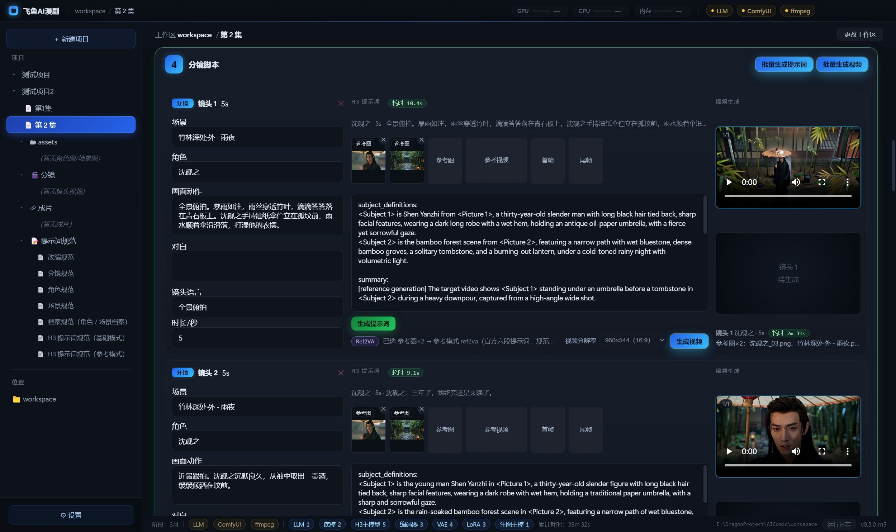
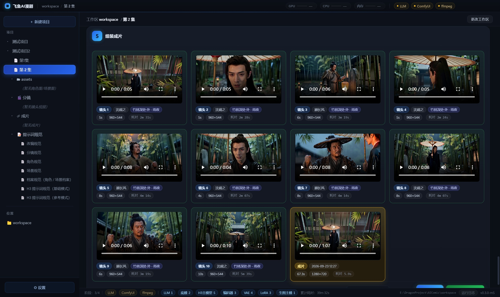

# 飞鱼AI短剧 Studio

把小说章节一键改编成漫剧的本地桌面工具：**改编 → 角色场景 → 分镜（提示词 + 视频）→ 组装成片**。
所有推理都在你自己的显卡上完成，不依赖云端 API，创作内容不出本机。

支持多项目 / 多文件夹 / 多集数；提示词规范、风格、模型方案都可自由编辑；退出保存现场，下次原样恢复。

## 界面流程

左侧是项目树（多项目 / 多文件夹 / 多集数），主区分 **4 块**：

1. **剧本创作** — 粘贴章节原文，LLM 改编成分镜用剧本（可手改；改动后下游模块会亮「需重新生成」脏标记）
2. **角色 & 场景** — 从改编稿提取角色 / 场景档案，Qwen-Image 2.1 出图，全剧一致
3. **分镜脚本** — 自动拆镜头（场景 / 角色 / 动作 / 对白 / 秒数）→ 生成 H3 提示词 → 逐镜头出视频
   （每行三区：分镜编辑 ｜ H3 提示词 + 分辨率 + 生成视频 ｜ 视频预览，可留多版自选）
4. **组装成片** — ffmpeg 拼接 + 按勾选烧录对白字幕，导出 MP4（每次导出的成片都留档）

另外还有两处：

- **项目角色场景库** — 全项目角色的形态变体 / 视角变体与素材总览
- **提示词配置中心** — 成品提示词 ｜ 通用规范 ｜ 模型专属规范 ｜ 风格轴，四层全部看得见、改得动

**全局风格**是 4 条轴（渲染 / 世界 / 体裁 / 调性），项目级设置，换轴就换写法，下次生成即生效。

## 界面实拍

以下为真实项目（第 2 集）的运行截图：

| 漫剧改编 | 角色 & 场景 |
|---|---|
|  |  |
| **分镜脚本** | **组装成片** |
|  |  |

## 环境要求

| 组件 | 说明 | 下载 |
|---|---|---|
| Windows 10 / 11 + NVIDIA 显卡 | 生图 8GB 起步；出视频建议 16GB 以上 | — |
| ComfyUI Desktop **≥ 0.37.0** | 出图 / 出视频的推理后端（**装好后先手动打开一次**） | [comfy.org/download](https://www.comfy.org/download) |
| llama.cpp（CUDA 版） | 文本推理 | [GitHub Releases](https://github.com/ggml-org/llama.cpp/releases) |
| ffmpeg（full build 含 libass） | 成片组装 + 字幕烧录 | [gyan.dev](https://www.gyan.dev/ffmpeg/builds/) |

> llama.cpp 下载 `llama-bXXXXX-bin-win-cuda-x64.zip` 后，**必须**再下同一 Release 的
> `cudart-llama-bin-win-cuda-x64.zip`，把其中 3 个 DLL 解压到 `llama-server.exe` 同目录。
> 缺了不报错但会静默回退 CPU、慢 6 倍。验证：`.\llama-cli.exe --list-devices` 输出里有 `CUDA0`。
>
> ⚠ 生图走的是 **Qwen-Image 2.1**，需要 ComfyUI **≥ 0.37.0** 且带 `EmptyQwenImage21LatentImage` 节点。
> ComfyUI 太旧会报节点不存在 —— 更新到最新版即可（软件在「设置 → 模型管家」也会提示）。

## 模型下载（全部为 hf-mirror 国内镜像直链，无需科学上网）

软件当前内置两套方案，**各带一个默认**：

| 用途 | 方案 | 说明 |
|---|---|---|
| 生图（默认） | Qwen-Image 2.1 | 中文提示词与画面内文字是强项，VAE 自带 alpha 通道；25 步 / CFG 1 |
| 视频（默认） | MiniMax H3 | 本地出片、音视频同出（含音频轨）；4-15 秒/镜、24fps，快 / 平衡 / 质量三档 |

模型统一放到 **ComfyUI 的 models 目录**（软件会自动检测，也能在模型管家里手动指定）。
下载完**不用自己找子目录**：打开「设置 → 模型管家」→ 点「批量导入文件夹…」选中放着下载文件的文件夹，
软件会递归扫描、自动分类拷到位（逐行绿灯就是齐了）。
（链接为 [hf-mirror.com](https://hf-mirror.com) 提供的 HuggingFace 国内镜像，与官方仓库同步）

### 必下（约 64 GB）

| 文件 | 大小 | 放到 | 直链 |
|---|---|---|---|
| Qwen3.5-9B-Q5_K_M.gguf（剧本 / 分镜用的文本 LLM） | 约 6.1GB | `models\text_encoders\` | [下载](https://hf-mirror.com/unsloth/Qwen3.5-9B-GGUF/resolve/main/Qwen3.5-9B-Q5_K_M.gguf) |
| qwen_image_2.1_int8_convrot.safetensors（生图主模型） | 约 7.3GB | `models\diffusion_models\` | [下载](https://hf-mirror.com/Comfy-Org/Qwen-Image-2.1/resolve/main/diffusion_models/qwen_image_2.1_int8_convrot.safetensors) |
| qwen3vl_8b_int8_convrot.safetensors（生图文本编码器） | 约 9.4GB | `models\text_encoders\` | [下载](https://hf-mirror.com/Comfy-Org/Qwen-Image-2.1/resolve/main/text_encoders/qwen3vl_8b_int8_convrot.safetensors) |
| qwen_image_2.1_vae_bf16.safetensors（生图 VAE） | 约 0.7GB | `models\vae\` | [下载](https://hf-mirror.com/Comfy-Org/Qwen-Image-2.1/resolve/main/vae/qwen_image_2.1_vae_bf16.safetensors) |
| minimax_h3_fl2va_pruned_int8_convrot.safetensors（视频主模型，文字 / 首尾帧线） | 约 19.5GB | `models\diffusion_models\` | [下载](https://hf-mirror.com/Comfy-Org/MiniMax-H3/resolve/main/diffusion_models/minimax_h3_fl2va_pruned_int8_convrot.safetensors) |
| qwen3vl_32b_minimax_h3_nvfp4_awq.safetensors（H3 文本编码器，50 系卡首选） | 约 15.7GB | `models\text_encoders\` | [下载](https://hf-mirror.com/Comfy-Org/MiniMax-H3/resolve/main/text_encoders/qwen3vl_32b_minimax_h3_nvfp4_awq.safetensors) |
| minimax_h3_video_vae_fp16.safetensors（H3 视频 VAE） | 约 5.2GB | `models\vae\` | [下载](https://hf-mirror.com/Comfy-Org/MiniMax-H3/resolve/main/vae/minimax_h3_video_vae_fp16.safetensors) |
| minimax_h3_audio_vae_fp32.safetensors（H3 音频 VAE） | 约 0.6GB | `models\vae\` | [下载](https://hf-mirror.com/Comfy-Org/MiniMax-H3/resolve/main/vae/minimax_h3_audio_vae_fp32.safetensors) |
| minimax_h3_fl2v_turbo_8step_v1.0_comfyui_bf16.safetensors（H3 加速 LoRA，快数倍） | 约 1.9GB | `models\loras\` | [下载](https://hf-mirror.com/Comfy-Org/MiniMax-H3/resolve/main/loras/minimax_h3_fl2v_turbo_8step_v1.0_comfyui_bf16.safetensors) |

> LoRA 是**可选档位**：不装也能出片（走 20 步满血档），装了能把采样压到 4-8 步。
> 「快」「平衡」两档按文件名自动挑 LoRA —— 多放几个不同的 LoRA 进去，档位会自动匹配。

### 可选

| 文件 | 说明 | 直链 |
|---|---|---|
| minimax_h3_ref2va_pruned_int8_convrot.safetensors（约 19.5GB） | 参考图 / 参考视频生成（ref2va），角色一致性更好 | [下载](https://hf-mirror.com/Comfy-Org/MiniMax-H3/resolve/main/diffusion_models/minimax_h3_ref2va_pruned_int8_convrot.safetensors) |
| minimax_h3_fl2v_turbo_4step_v1.0_768p_comfyui_bf16.safetensors（约 1.9GB） | 4 步加速 LoRA（768p 专用，「快」档优先匹配） | [下载](https://hf-mirror.com/Comfy-Org/MiniMax-H3/resolve/main/loras/minimax_h3_fl2v_turbo_4step_v1.0_768p_comfyui_bf16.safetensors) |
| minimax_h3_ref2v_turbo_4step_v0.1_comfyui_bf16.safetensors（约 1.9GB） | ref2va 支路专用加速 LoRA | [下载](https://hf-mirror.com/Comfy-Org/MiniMax-H3/resolve/main/loras/minimax_h3_ref2v_turbo_4step_v0.1_comfyui_bf16.safetensors) |
| qwen3vl_32b_minimax_h3_int8_convrot.safetensors（约 27GB） | H3 文本编码器通用版（非 50 系卡用它，兼容性最好） | [下载](https://hf-mirror.com/Comfy-Org/MiniMax-H3/resolve/main/text_encoders/qwen3vl_32b_minimax_h3_int8_convrot.safetensors) |
| qwen3vl_8b_w4a8.safetensors（约 6.3GB） | 生图文本编码器的省显存版（显存吃紧时替换 9.4GB 那版） | [下载](https://hf-mirror.com/Comfy-Org/Qwen-Image-2.1/resolve/main/text_encoders/qwen3vl_8b_w4a8.safetensors) |

> 20GB 级大文件建议用 [aria2](https://github.com/aria2/aria2/releases) 多线程下载（`aria2c -x16 -s16 -c <直链>`），断点续传更稳。

## 显存说明

LLM（约 7GB）、生图（主模型 + 编码器约 17GB）、视频（主模型约 20GB）三者互斥，
软件按阶段自动启停引擎、自动让出显存，无需手工干预。

- **8-12GB**：跑生图没问题（可用 `qwen3vl_8b_w4a8` 省显存版编码器）；出视频需降分辨率、靠 ComfyUI offload
- **16GB 以上**：生图 + 视频都顺畅
- 遇到 `CUDA out of memory`：点设置页「立即释放显存」，或降低分辨率 / 帧数、改用 4 步 Turbo LoRA

## 快速开始

```bash
npm install
npm run dev      # 开发模式（vite + electron 并行，热更新）
```

或双击 `启动软件.bat`。**第一次使用只要三步：**

1. **先手动打开一次 ComfyUI Desktop**（双击桌面图标，看到它的界面出来就行，之后可以最小化或关掉）。
   软件只负责调用它，不负责启动它的界面；这一步做过一次即可，之后由软件按需接管。
   顺手确认它是 **0.37.0 以上**的版本（Qwen-Image 2.1 要用的节点在老版本里没有）。
2. 打开本软件 → **设置 → 模型管家**：那里列出软件需要的每一个模型、该放进哪个子目录。
   点「批量导入文件夹…」选中放着下载好的模型的文件夹（会递归扫描），
   会自动拷到 ComfyUI 该放的子目录（**拷完原始下载文件删不删都不影响使用**）。
   模型目录不是 ComfyUI 默认位置的，点「选择目录…」指一下即可。
3. 回主界面开始创作。工作区路径建议纯英文（设置 → 工作区 可改）。

> **服务不用手动启停**：LLM（剧本 / 分镜）和 ComfyUI（出图 / 出视频）都由软件在用到时自动拉起、用完自动让出显存。
> 顶部状态条能看到 LLM / ComfyUI / ffmpeg 三个依赖的实时状态，旁边还有 GPU / CPU / 显存 / 内存的实时占用。
> 只有引擎装在非默认位置、或想手动接管 llama 启停时，才用「设置 → 高级设置」。

### 想换模型？不用改代码

「设置 → 生成模型方案」里，生图模型和视频模型各是一个下拉框。
**一份方案 JSON + 一个 ComfyUI API 工作流 JSON = 一个新模型**，工作流模板、要哪些模型文件、节点接线、
帧参数、档位表、以及模型专属的提示词规范，全部跟着方案走。
把文件放进 `工作区\profiles\`、`工作区\workflows\`，点「重新扫描」即可。

## 常见问题

| 现象 | 解决 |
|---|---|
| 出图 / 出视频没反应、状态条 ComfyUI 是灰的 | **先手动打开一次 ComfyUI Desktop**（软件只调用它、不启动它的界面） |
| 出图报「找不到节点 EmptyQwenImage21LatentImage」 | ComfyUI 版本太旧，更新到 **0.37.0 以上** |
| 生成极慢、GPU 占用几乎为 0 | llama.cpp 缺 CUDA 运行时 → 补 3 个 DLL，见上文 |
| 导出报「未找到 ffmpeg」/ subtitles 报错 | ffmpeg 需 **full build**（gyan.dev 的 full 版），放到 `workspace\tools\` 或加入 PATH（也可以在「设置 → 高级设置」里点「浏览…」直接指定 ffmpeg.exe） |
| 出图报模型找不到 | 模型管家点「重新检测」，按红灯那一行补齐（Qwen-Image 2.1 三件套） |
| 「工作流占位符未解析：__H3_XXX__」 | 对应 H3 模型没下载，按提示补齐 |
| `CUDA out of memory` | 设置页「立即释放显存」/ 降低分辨率帧数 / 用 4 步 Turbo LoRA |
| LLM 连不上 | 软件自动用 `127.0.0.1:8080` 拉起 llama-server；该端口被别的程序占用时先关掉占用者 |
| 分镜拆出来镜头太多 / 总时长对不上 | 提示词配置中心 → 通用规范里能直接改分镜规范（广告体裁另有专门的一份）；改完下次生成即生效 |

## 交流

QQ 群：**1036028422** — 使用中有问题欢迎进群讨论。

## 打赏

开源不易，从改编、出图到成片的每一步都是用爱发电。
如果这个软件帮你把小说变成了短剧，省下了真金白银的制作费，欢迎请作者喝杯咖啡 ☕
金额随意，心意最重要 —— 你的支持就是我继续更新的动力！

**打赏方式**：扫描下方二维码添加作者微信，备注「飞鱼」，添加后微信转账即可。

<p align="center"></p>

## License

随意使用，可商用。如果觉得好用，欢迎回来点个 Star 或请作者喝杯咖啡。
